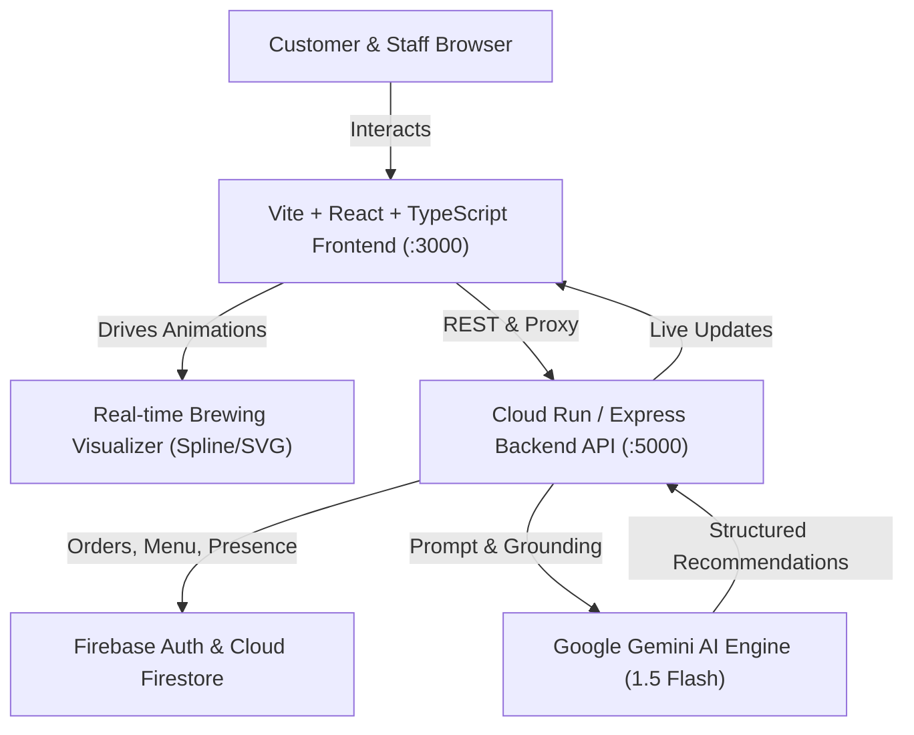

# ☕ Café Companion — Your Café, Smarter

> **Production-Ready Full-Stack Web Application** powered by **Google Gemini** & **Google Cloud / Firebase**, featuring interactive 3D brewing visuals, smart wait-time prediction, AI conversational ordering ("Café AI"), while-you-wait mini-games & sports predictions (with Café Points rewards), and an opt-in live social presence layer ("Café Open Space").

---

## 🌟 Visual Theme — Light & Airy

Café Companion is deliberately crafted around a calm, light, and welcoming roastery atmosphere:
- **Base Palette**: Soft cream & off-white (`#FBF8F3`, `#FFFFFF`)
- **Accents**: Warm café-brown (`#6F4E37`, `#B08968`)
- **Action & Status**: Fresh sage green (`#7FA98A`) & warm amber (`#E8A94C`)
- **Crowd Badges**: Soft pill badges (🟢 Low crowd 5–10 min, 🟡 Moderate 10–20 min, 🔴 Busy 20+ min)
- **Cards & Surfaces**: Rounded corners (14–20px), soft diffuse shadows, generous whitespace

---

## 🚀 Key Modules & End-to-End Capabilities

### 1. Customer Experience
1. **Customer Home (`/`)**:
   - Hero: *"Your café, smarter. Discover. Order. Connect. Enjoy."*
   - Live status ticker & roastery highlights
   - Personalized Gemini recommendations shelf
   - Active live order banner with direct link to live brewing
2. **Café Discovery (`/discover`)**:
   - Interactive Google Maps light map view with styled café pins
   - Filter by Distance, Rating, Wait time, Work-Friendly, Quiet, Social, Outdoor Seating
   - Real-time crowd levels & wait times
3. **Café Details (`/cafe/:id`)**:
   - Location, hours, seating information, atmosphere tags
   - **"Best Time to Visit"**: Hourly traffic prediction graph with Gemini pattern explanation
   - Live Open Space presence tile: *"🟢 3 people here are open to connect"*
4. **Artisan Roastery Menu (`/menu`)**:
   - Categorized menu (Coffee, Cold Brew, Teas, Bakery, Food & Snacks)
   - Dietary filters: Vegetarian, 100% Vegan, Low Sugar, High Protein
   - Customizer: cup sizes (8oz, 12oz, 16oz), milk alternatives (Oat, Almond, Whole), sweetness (0%–100%)
5. **AI Conversational Ordering ("Café AI")**:
   - Floating Gemini assistant chat bubble
   - Natural language queries: *"I have ₹250 and 10 minutes. I want something cold and not too sweet"*
   - Strictly grounded in real Firestore menu items & prices (never invents unavailable items)
   - One-click **Add to Tray** directly from AI chat
6. **Live Brewing Order Tracker**:
   - 4-stage brewing animation driven directly by Firestore status:
     - `NEW`: Fresh single-origin beans ground & tamped
     - `PREPARING`: Steam rising, 9-bar espresso streaming into cup, microfoam pouring
     - `READY`: Warm crema crown, etched latte art, steam wisps, pickup counter chime!
   - Real-time preparation ETA
7. **Play While You Wait & Rewards**:
   - Mini-games sized to wait time:
     - **Coffee Connoisseur Quiz** (+60 pts)
     - **Guess the Coffee Blend** (+40 pts)
     - **Live Match Sports Predictions** (wager points with live odds)
   - **Café Points Wallet**: Balance, today's earnings, transaction history
   - **Rewards Catalog**: Redeem points for vouchers (₹20 off, free cookie, ₹50 combo, ₹150 voucher)
   - **Server-side points validation**: Fraud-proof protection against client tampering
8. **Café Open Space (Live Presence & Connection)**:
   - Opt-in live social layer for people physically at the café
   - Check-in toggle: *"🟢 Open to Connect"* (auto-expires in ~90m or order pickup)
   - **Who's Here Panel**: Shows active patrons using soft anonymous aliases (*"Corner Table Thinker"*, *"Window Seat Designer"*)
   - Low-pressure **"👋 wave"**: recipient accepts (unlocks ephemeral chat with Gemini icebreaker) or ignores silently without rejection notice
   - Strict privacy: off by default, zero staff visibility, one-tap leave

### 2. Café Staff / Admin Dashboard
1. **Live Order Management Kanban**:
   - Columns: `NEW` | `PREPARING` | `READY` | `COMPLETED`
   - Staff click to advance stages -> **instantly reflects on the customer's phone & brewing animation**
2. **KPI Summary Cards**:
   - Orders Today, Gross Revenue, Avg Wait Time, Customer Satisfaction, Current Queue, Popular Product
3. **Menu Catalog Management**:
   - Add new items, adjust pricing, toggle *In Stock* / *Sold Out*
4. **"Understand the Room" AI Operational Insights**:
   - Gemini summarizes recent customer feedback & queue bottlenecks into actionable operational cards
5. **Admin AI Assistant**:
   - Ask Gemini: *"What were our busiest hours today?"*, *"Which items should we promote?"*

---

## 🏛️ Architecture & Google Technology



---

## 🛠️ Quick Start & Setup

### Prerequisites
- Node.js v18+ (tested on Node v24)
- npm v9+

### 1. Start Backend API
```bash
cd backend
npm install
npm start
# Listening on http://localhost:5000
```

### 2. Start Frontend App
```bash
cd frontend
npm install
npm run dev
# Running on http://localhost:3000
```

---

## 🔑 Environment Variables (`.env`)

Create a `.env` file in the root or `backend/` directory:

```env
# Google Gemini API Key (Get at: https://aistudio.google.com)
GEMINI_API_KEY=your_gemini_api_key_here

# Google Maps JavaScript API Key
VITE_GOOGLE_MAPS_API_KEY=your_google_maps_key_here

# Firebase Web Configuration
VITE_FIREBASE_API_KEY=your_firebase_api_key
VITE_FIREBASE_AUTH_DOMAIN=your_project.firebaseapp.com
VITE_FIREBASE_PROJECT_ID=your_project_id
VITE_FIREBASE_STORAGE_BUCKET=your_project.appspot.com
VITE_FIREBASE_MESSAGING_SENDER_ID=your_sender_id
VITE_FIREBASE_APP_ID=your_app_id

PORT=5000
```

*(Note: Out-of-the-box, the app runs with an embedded Café Companion Gemini & Data Simulator so you can demo immediately without entering keys!)*

---

## ⏱️ 3–5 Minute Hackathon Demo Flow

1. **Open App**: Land on the light & airy Home page showing *"Your café, smarter."*
2. **Find a Café**: Click **Discover Cafés** to view nearby roasteries on the Google Maps view, checking live crowd levels (🟢 Low crowd) and estimated wait times.
3. **Open Menu & Ask Gemini**: Click on **Order Menu**, then tap **"Ask Café AI"**.
4. **Natural Language Request**: Type:
   > *"I have ₹250 and 10 minutes. I want something cold and not too sweet."*
5. **AI Recommendation**: Gemini analyzes the real menu and suggests the **Iced Americano (₹150)** and **Avocado Sourdough Tartine (₹240)**.
6. **Add to Tray & Place Order**: Click **Add** -> open Cart Tray -> select a ₹20 tip -> click **Place Order**.
7. **Watch Live Brewing Animation**: Order enters `NEW` state, then transitions to `PREPARING` with real-time rising steam, liquid extraction, and ETA countdown.
8. **Play While You Wait**: Click **Coffee Quiz** inside the tracker, answer questions, and earn **+60 Café Points**!
9. **Staff Kanban**: Toggle the navbar role switch to **Staff** -> view order in `PREPARING` column -> click **"Mark as Ready"**.
10. **Customer Pickup Celebration**: Switch back to Customer -> see **"🎉 Order Ready!"** notification with confetti, and submit a 5-star review.
11. **AI Room Insights**: Staff dashboard immediately receives the feedback and updates the **AI Café Insights ("Understand the Room")** card.
